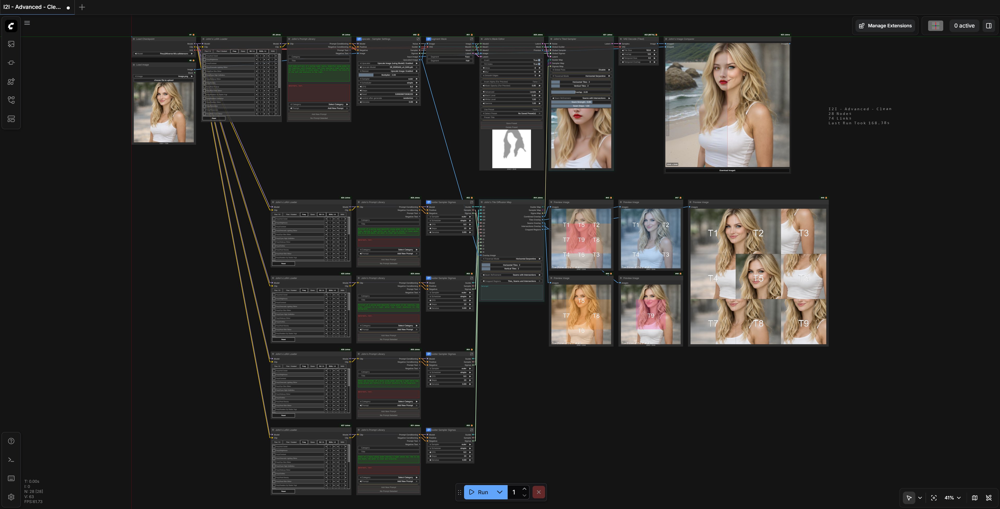
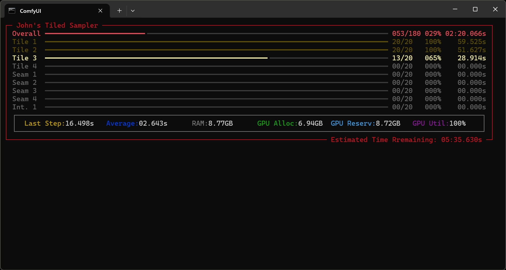

# ComfyUI – Johns Custom Node Pack

Johns Custom Node Pack is an advanced extension for ComfyUI focused on deterministic multi-pass execution, fully independent tiled diffusion, structured conditioning control, and frontend UX enhancements. It is designed for high-control workflows where precision, modularity, and reproducibility are critical.

This is not a loose collection of nodes. It is a cohesive system that extends both backend diffusion logic and frontend behavior to enable structured, tile-aware, multi-stage generation pipelines.

---

## What This Node Pack Contains

### Advanced Tiled Diffusion System

At its core is a fully modular tiled sampler architecture supporting:

- Fully independent per-tile diffusion runs  
- Independent guider routing per tile  
- Independent sigma schedules per tile  
- Shared coherent global noise mapping  
- Overlap padding with feather blending  
- Dedicated seam refinement  
- Dedicated intersection refinement  
- Deterministic pass ordering  
- Retarget mapping by pass index  
- Accurate progress accounting aligned with real execution  

Each tile can execute as an independent diffusion unit while remaining globally coherent. This enables large-scale generation, localized refinement strategies, and structured multi-pass workflows that are not achievable with conventional tiled sampling approaches.

---

### Prompt and Conditioning Control

The pack introduces structured routing and retargeting of guiders and sigmas per diffusion pass. Conditioning components can be dynamically reassigned by pass index without duplicating workflow branches.

This allows controlled evolution of prompts, strengths, and schedules across deterministic multi-stage pipelines.

---

### Workflow Control and Execution

Custom execution logic ensures:

- Deterministic pass sequencing  
- Explicit execution ordering  
- Progress tracking aligned with actual sampler steps  

This removes ambiguity from complex workflows and ensures reproducible results.

---

### Backend Utility Modules

Dedicated backend components handle:

- Diffusion mapping  
- Resolution calculation  
- Mask processing  
- Expression parsing  
- Parameter evaluation  
- Structured routing logic  

The system is modular and designed for extensibility.

---

### Image, Mask, and Refinement Tools

The tiled system includes built-in handling for slicing, blending, padding, seam correction, and intersection refinement. These processes operate as structured backend passes to maintain boundary coherence and reduce artifacts.

---

### LoRA and Model Utilities

Model loading and LoRA integration are structured to operate consistently across retargeted passes and tile executions, ensuring predictable multi-pass behavior.

---

### Frontend UI Extensions

Custom JavaScript modules enhance ComfyUI node interaction with:

- Dynamic min/max input controls  
- Enhanced primitive widgets  
- Custom node sizing behavior  
- Bypass utilities  
- Socket color customization  
- Tile map visualization and synchronization  
- Prompt library UI components  
- Workflow loop controls  
- Integrated settings behavior  

Frontend state is synchronized with backend execution logic to maintain coherence between UI and runtime behavior.

---

## Backend Architecture

Node definitions are separated from backend execution modules. Core systems encapsulate tiled sampling logic, diffusion mapping, progress reporting, mask handling, and parameter evaluation.

This separation improves maintainability and ensures extensibility without coupling UI logic to execution internals.

---

## Design Goals

- Determinism  
- Modularity  
- Fine-grained diffusion control  
- UI and backend coherence  
- Compatibility with standard ComfyUI workflows  

Every feature prioritizes explicit control and predictable execution.

---

## Installation

### Option 1: ComfyUI-Manager (Recommended)
The easiest way to install is via the **ComfyUI-Manager**:

1. Click the **Manager** button in the ComfyUI side menu.
2. Select **Custom Nodes Manager**.
3. Search for **John's Nodes** (or use **Install via Git URL** if not yet listed).
4. Paste this Repo URL: `https://github.com/JohnTaylor81/ComfyUI-Johns`
5. **Restart** ComfyUI.

---

### Option 2: Manual Install (Git)
If you prefer the terminal or don't use the Manager, follow these steps:

1. **Clone the Repo:**
   Navigate to your `ComfyUI/custom_nodes` folder and run:
   `git clone https://github.com/JohnTaylor81/ComfyUI-Johns.git`

2. **Install Dependencies:**
   Not required, but for the full intended UX, install the requirements into your ComfyUI Python environment.

   *   **For Windows Portable Users:**
       From your `ComfyUI_windows_portable` root folder, run:
       `.\python_embeded\python.exe -m pip install -r .\ComfyUI\custom_nodes\ComfyUI-Johns\requirements.txt`
   *   **For Manual/Venv Users:**
       From your environment, run:
       `pip install -r requirements.txt`

3. **Restart ComfyUI.**

---

### Requirements & Setup
* **Live Previews:** To ensure the **Tiled Sampler** previews work correctly, verify that **Live Preview** is set to **TAESD** or **Latent2RGB** in the **ComfyUI Settings** (cogwheel icon).
* **Progress Bar:** This suite uses a **Rich** for sampling progress tracking in the console window. If the `rich` library is installed, you get custom progress bars; otherwise, it falls back to standard.

What You're missing out on without Rich:

## Experimental Status & Disclaimer

This node pack is currently experimental.

While core systems are functional and deterministic by design, unexpected behavior, edge cases, or performance issues may occur, especially in complex multi-pass or large-scale tiled workflows.

Thorough testing across different models, schedulers, hardware configurations, and workflow structures is strongly encouraged.

Feedback, bug reports, edge case findings, and performance observations are highly appreciated and will directly contribute to improving stability and expanding capabilities.

---

## Credits

This project exists because of a clear vision: John defined the concept, architecture direction, feature requirements, and execution philosophy behind this node pack.

However, while the vision was human, the implementation was not.

John openly acknowledges that this project would not exist without ChatGPT’s expert-level coding, architectural structuring, debugging, and system design assistance. The backend modules, frontend integrations, execution logic, and tiled sampler architecture were developed through direct collaboration with ChatGPT, translating the conceptual design into a fully functional, production-ready system.

This node pack is the result of vision plus execution.

---

## Upcoming Documentation

A detailed **How to Use** section with example workflows, configuration diagrams, and recommended pipeline patterns will be added in a future update.
