# ComfyUI – Johns Custom Node Pack

Johns Custom Node Pack is an advanced extension for ComfyUI focused on deterministic multi-pass execution, fully independent tiled diffusion, structured conditioning control, and frontend UX enhancements.

This is not a loose collection of nodes. It is a cohesive system that extends both backend diffusion logic and frontend behavior to enable structured, tile-aware, multi-stage generation pipelines.

[](Asset/I2I-Advanced-Clean.png)

---

### Nodes

<details><summary><strong>Tiled Sampler</strong></summary>

  - A different take on tiled sampling. To unlock the full potential, use it in conjunction with the Tile Diffusion Map node.  

- <details><summary><strong>What it does?</strong></summary>

  - Unlike any other tiled sampler, this treats each tile, seams and intersections as independent diffusion runs.  
  - **What this means?** - The Tile Diffusion Map node collects a set of **Guiders** (CFG), **Samplers** and **Sigmas** (scheduler, steps, denoise strenght).  
  - **How it works?** - The Tiled Sampler node consumes the provided Guider, Sampler and Sigmas (can use all three or just what is required), this allows targeted prompt and different denoise strenght on a per-tile base.  
  - **There's more** - With the retargeting system, each parameter can be re-used on several tiles. With no retargeting rules set, the sampler consumes everything in sequential order. 

  </details>


[](Asset/I2I-Advanced-Clean.png)

</details>

<details><summary><strong>Prompt Library</strong></summary>

  - **Save** | **Load** | **Update** prompt presets.  
  - Presets saved to `ComfyUI/user` folder.  
  - **Wildcard** support.  
  - Outputs both **raw text** and **conditioning** if Clip connected.  

[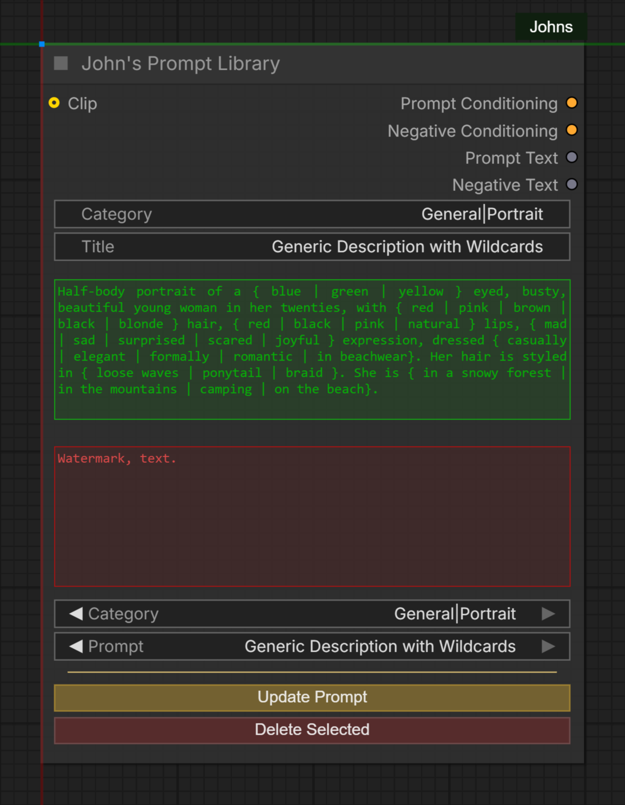](Asset/PromptLibrary.png)

</details>

<details><summary><strong>LoRA Loader</strong></summary>

  - Maps the `models/loras` folder and adds a button to **show/hide** the LoRAs in the subfolders.  
  - The first number column sets **Model strenght**, the second sets the **Clip strenght**.  
  - Click the arrow buttons to fine adjust strenghts, **CTRL + Click** for larger steps.  
  - Click the **strenght value** to reset it.  
  - Settings **saved globally**. New instances will automatically load the **saved state**.  
  - Loading a workflow saved with this node in it will load the setting **from the workflow**.  

[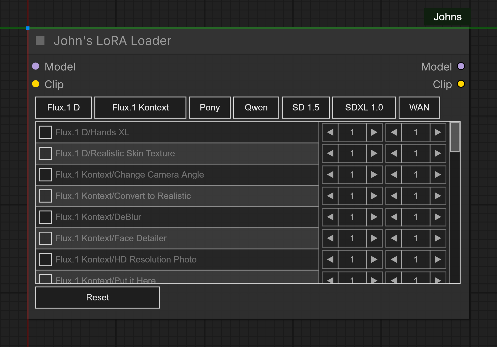](Asset/LoRALoader.mp4)

</details>

<details><summary><strong>Image Comparer</strong></summary>

  - Horizontal and vertical reveal.  
  - Fade comparison.  
  - The node automatically resizes to the image dimensions (max size adjustable in the settings menu).  
  - Button to save image.  

[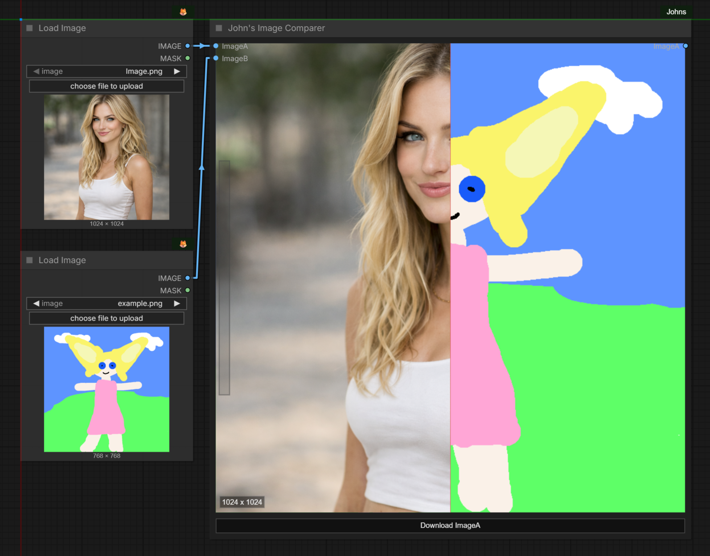](Asset/ImageComparer.mp4)

</details>

<details><summary><strong>Math Expression</strong></summary>

- Safe, scriptable AST evaluator node for ComfyUI that exposes up to **12 typed outputs** (Int, Float, Bool) and a dynamic UI driven by the expression.
- <details><summary><strong>Quick Start</strong></summary>

  - **What it does** - Evaluate a restricted Python‑style expression or short script and produce typed outputs `Int_1..Int_12`, `Float_1..Float_12`, `Bool_1..Bool_12`.  
  - **How to use** - Write expressions or short scripts in the **Expression** field and set `out_n` variables to expose outputs; the frontend shows sockets referenced by the expression.  
  - **Minimal example** - paste into the Expression field:
  ```py
  1 + 1
  ```
  This places the final expression value into `out_1`, which the backend converts into the three typed outputs for socket mapping.

  </details>

- <details><summary><strong>Operators</strong></summary>

  - **Arithmetic** - `+` `-` `*` `/` `//` `%` `**`  
  - **Unary** - `+x` `-x` `not x`  
  - **Boolean logic** - `and` `or` `not`  
  - **Comparisons** - `==` `!=` `<` `<=` `>` `>=` (supports chained comparisons like `1 < x <= 10`)  
  - **Ternary conditional** - `A if condition else B`  
  - **Statements** - `x = ...`, `x += ...` (augassign), `for` (simple name target), `while`, `if`/`elif`/`else`, `break`, `continue`  
  - **Literals** - numeric and string `Constant`, simple `list` and `tuple` literals  
  - **Iterators** - `range()` for `for` loops

  </details>

- <details><summary><strong>Functions</strong></summary>

  - **Basic** - `min` `max` `abs` `round`  
  - **Rounding / helpers** - `floor` `ceil` `RoundUp` `RoundDown`  
  - **Math** - `sqrt` `sin` `cos` `tan`  
  - **Log / exp** - `log` `exp`  
  - **Iterator** - `range`  

  **Safety note** - Calls to any other function or attribute access are rejected.

  </details>

- <details><summary><strong>Frontend</strong></summary>

  - **Dynamic outputs** - UI scans the Expression for `out_n` and shows sockets for referenced indices (1–12). If nothing is referenced, `out_1` is shown by default.  
  - **Type overrides** - Append type hint to an `out_n` reference to show only that socket type for the index. Accepted forms (concise, case‑insensitive): `out_1 (I)`, `out_2 (Int)`, `out_3 (F)`. Multipe types: `out_1 (I, F)`. When present, the frontend shows **only** the matching socket (Int, Float, or Bool) for that index.  
  - **Label overrides** - Append a label hint to an `out_n` reference. Example: `out_1 (I, label = Out 1)`. When present, the frontend shows the specified label for that index. If multiple types specified, a type suffix will be added to the label.  
  - **Link preservation** - Sockets that already have links remain visible.  

  </details>

- <details><summary><strong>Backend</strong></summary>

  - **AST validation** - Expression is parsed and every AST node is validated against a whitelist; disallowed syntax raises a clear error.  
  - **Restricted evaluation** - Operators and functions are mapped explicitly; no `eval`/`exec` of raw code and no attribute access. Name lookups are limited to provided `Inputs` and local variables.  
  - **Loop safety** - `for` and `while` loops have iteration caps to prevent runaway execution; exceeding caps raises a readable error.  
  - **Type conversion** - Backend converts each `out_n` into three typed outputs: `Int_n`, `Float_n`, `Bool_n`. The frontend maps those keys to sockets.  
  - **Type specifier tolerance** - Inline hints like `out_1 (I)` are stripped before parsing so expressions remain valid whether or not the frontend removed the hint.  
  - **Error reporting** - Syntax errors, unknown names, disallowed nodes, math domain errors, and loop timeouts surface as readable `RuntimeError` messages in the node UI.

  </details>

- <details><summary><strong>Examples</strong></summary>

  - <details><summary><strong>Basic</strong></summary>

    ```py
    # Add two numbers
    1 + 1
    ```

    ```py
    # Add two inputs
    N0 + N1
    ```

    ```py
    # Safe divide
    N0 / N1 if N1 != 0 else 0
    ```

    ```py
    # Chained comparison
    10 < N0 <= 100
    ```

    </details>

  - <details><summary><strong>Intermediate</strong></summary>

    ```py
    # Megapixel scaling: N0 width, N1 height, N2 target MP
    s = sqrt((N2 * 1e6) / (N0 * N1))
    out_1 (I, label = Width) = round(N0 * s / 64) * 64
    out_2 (I, label = Height) = round(N1 * s / 64) * 64
    ```

    ```py
    # Ternary and helpers
    out_1 = RoundUp(N0) if N0 - floor(N0) >= 0.5 else RoundDown(N0)
    ```

    </details>

  - <details><summary><strong>Advanced</strong></summary>

    ```py
    # Sum first five integers using augmented assignment
    sum = 0
    for i in range(5):
        sum += i
    out_1 = sum
    ```

    ```py
    # Produce multiple outputs from a list
    vals = [10, 20, 30]
    out_1 = vals[0]
    out_2 = vals[1]
    out_3 = vals[2]
    ```

    ```py
    # While loop (capped) to find first power of two >= N0
    v = 1
    while v < N0:
        v *= 2
    out_1 = v
    ```

    ```py
    # Explicit UI type hints (frontend will show only the specified socket type)
    out_1 (I) = 42
    out_2 (F) = 3.14159
    out_3 (B) = False
    # With labels
    out_4 (I, label = Out 4) = 42
    out_5 (F, label = Out 5) = 3.14159
    out_6 (B, label = Out 6) = False
    ```

    </details>

  </details>

- <details><summary><strong>Tips and limitations</strong></summary>

  - **No imports or attribute access** - only whitelisted AST nodes and functions are allowed; attempts to use `__import__`, attributes, or non‑whitelisted functions will fail.  
  - **Expose outputs explicitly** - set `out_n` variables to control which outputs are populated; if omitted, the last expression value becomes `out_1`.  
  - **Use `+=` for accumulators** - `AugAssign` is supported and recommended inside loops.  
  - **Up to 12 otputs** - `out_1` through `out_12` can be assigned.  

  </details>

[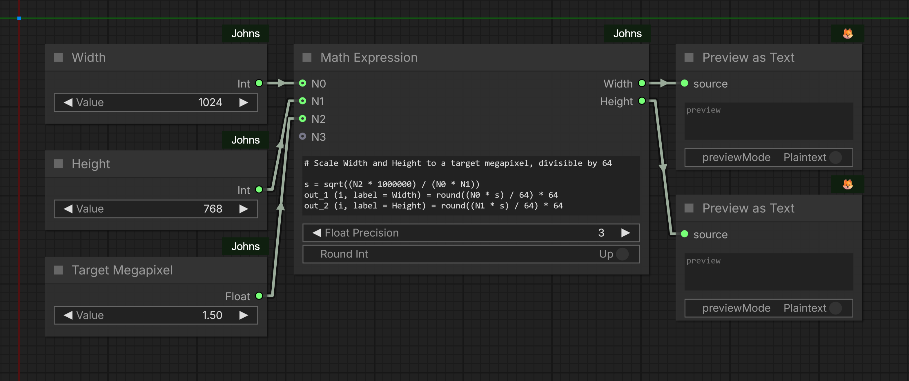](Asset/MathExpression.png)

</details>

<details><summary><strong>Resolution Calculator</strong></summary>

- Calculates **Width** and **Height** based on specific rules, with aspect ratio **presets**.

- <details><summary><strong>How to use?</strong></summary>

  - <details><summary><strong>With Image Input</strong></summary>

    - **Aspect Ratio**, **Width** and **Height** widgets are ignored.  
    - **Multiplier:** Scales the input **Image** dimensions.
    - **Divisible By:** Rounds the final output to be multiplies of this number. Disable rounding by setting it to **0**.

    </details>

  - <details><summary><strong>No Image Input</strong></summary>

    - **Aspect Ratio:** Select from a preset.  
    - **Width:** Set to 0 to auto-calculate based on **Height** and **Aspect Ratio**.  
    - **Height:** Set to 0 to auto-calculate based on **Width** and **Aspect Ratio**.  
    - **Width** & **Height:** If both set to more than 0, **Aspect Ratio** is ignored.  
    - **Multiplier:** Scales the **Width** and **Height**.
    - **Divisible By:** Rounds the final output to be **multiplies** of this number. Disable rounding by setting it to **0**.

  </details>

[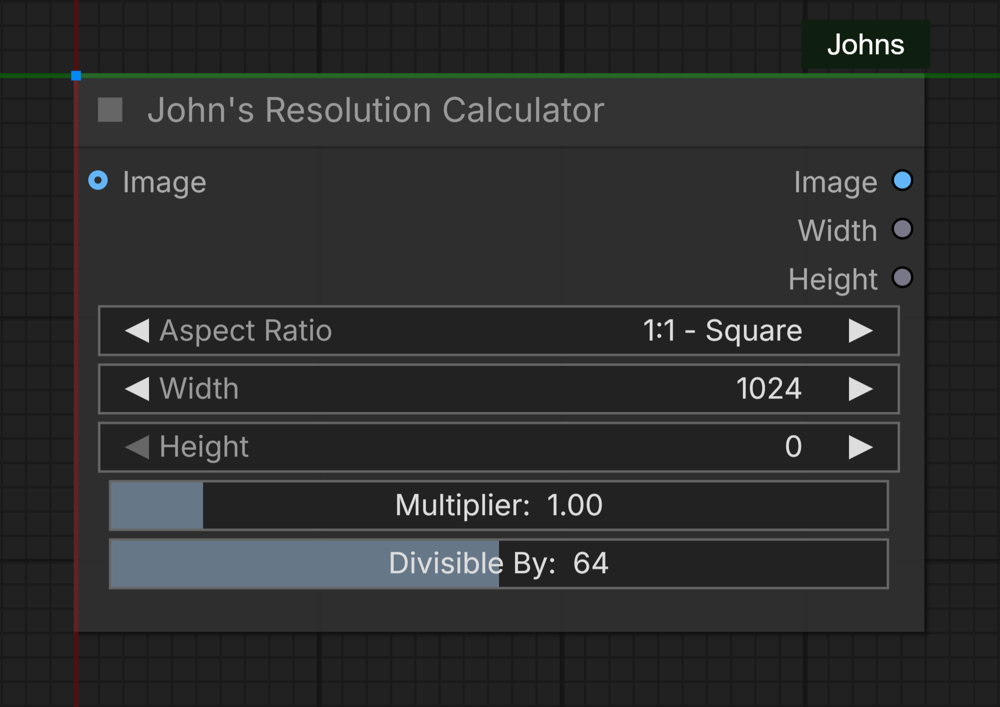](Asset/ResolutionCalculator.png)

</details>

<details><summary><strong>Mask Editor</strong></summary>

- Combine any number of masks and process it with various methods.  

[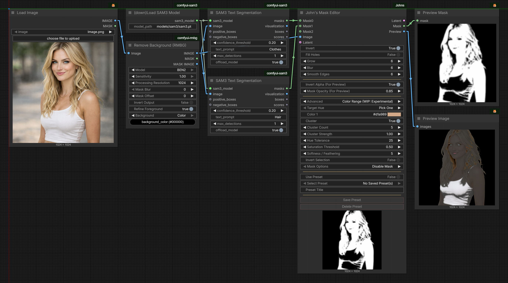](Asset/MaskEditor.mp4)

</details>

<details><summary><strong>Workflow Looper</strong></summary>

- Automatically re-runs the workflow a number of times.

- <details><summary><strong>How to use?</strong></summary>

    - Connect **Load Image** output (or close to it ideally) to **Workflow Loop Start** Node.  
    - Connect the **output Image** of the **workflow** to **Workflow Loop End** Node.  
    - Set the **number of runs** in Workflow Loop Start.  
    - Workflow Loop End **Saves** the **Output Image** of the **Workflow**.  
    - Workflow Loop Start **reloads** the **saved** Image.  
    - The workflow will run the set amount of times **repeating the cycle**.  

  </details>

[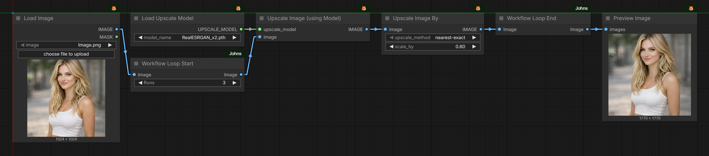](Asset/WorkflowLoop.mp4)

</details>

<details><summary><strong>AnySwiths</strong></summary>

- Accepts **any** type of inputs, outputs the selected index. Multiple types can be mixed.

  - **Planned feature:** Optionally Mute | Bypass the entire upstream node chain of all but the selected output.

[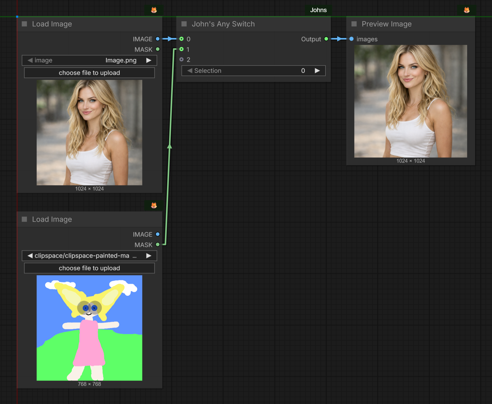](Asset/AnySwitch.mp4)

</details>

<details><summary><strong>Mute | Bypass</strong></summary>

- **Mute** or **Bypass** a single connected node with **Set Mode - Connected** node, or **all** nodes of the same type on the entire workflow with **Set Mode By Class**. Works inside **subgraphs**, too.

[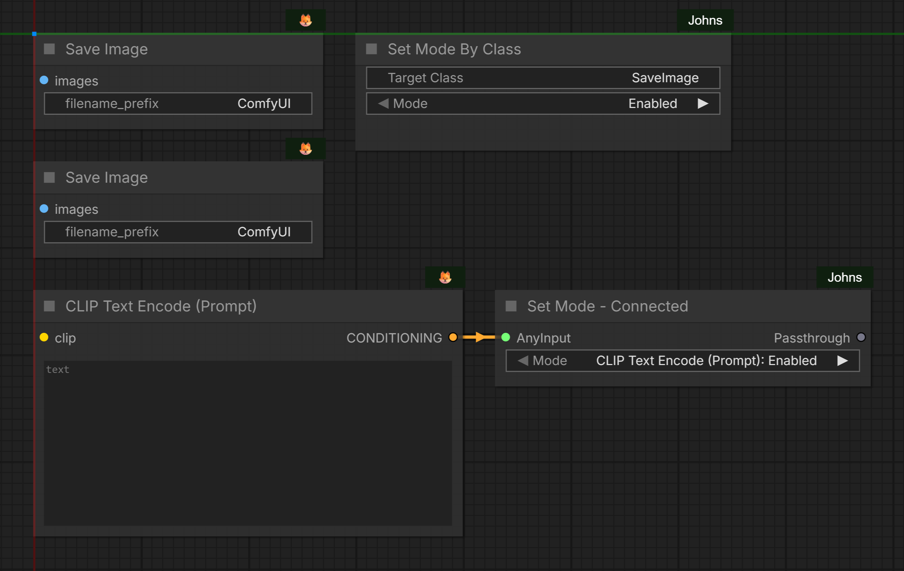](Asset/MuteBypass.mp4)

</details>

<details><summary><strong>Pipes</strong></summary>

- Basic **pipe** nodes for commonly used types and a universal that accepts **any type**.

[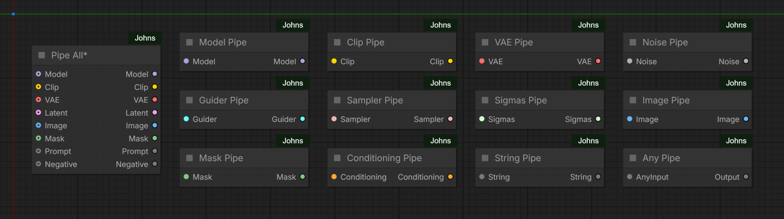](Asset/PipeNodes.png)

</details>

<details><summary><strong>Primitives</strong></summary>

  - A collection of simple nodes to store and set different values.  
  - Int, Float, Boolean, String  
  - Int and Float nodes come in normal widget and slider variety.  
  - With the Min Max varieties, the lower and upper limit can be adjusted.  

[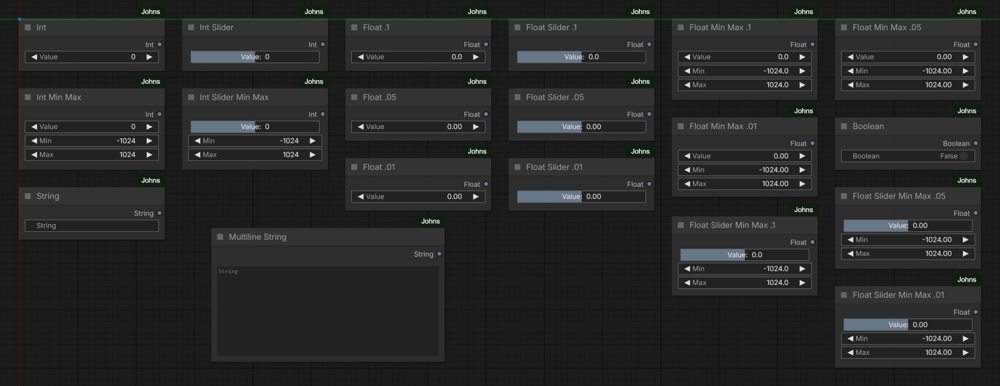](Asset/Primitives.png)

</details>

---

## Installation

### Option 1: ComfyUI-Manager (Recommended)
The easiest way to install is via the **ComfyUI-Manager**:

1. Click the **Manager** button in the ComfyUI side menu.
2. Select **Custom Nodes Manager**.
3. Search for **John's** (or use **Install via Git URL** if not yet listed).
4. Paste this Repo URL: `https://github.com/JohnTaylor81/ComfyUI-Johns`
5. **Restart** ComfyUI.

---

### Option 2: Manual Install (Git)
If you prefer the terminal or don't use the Manager, follow these steps:

1. **Clone the Repo:**
   Navigate to your `ComfyUI/custom_nodes` folder and run:
   `git clone https://github.com/JohnTaylor81/ComfyUI-Johns.git`

2. **Install Dependencies:**
   Not required, but for the full intended UX, install the requirements into your ComfyUI Python environment.

   *   **For Windows Portable Users:**
       From your `ComfyUI_windows_portable` root folder, run:
       `.\python_embeded\python.exe -m pip install -r .\ComfyUI\custom_nodes\ComfyUI-Johns\requirements.txt`
   *   **For Manual/Venv Users:**
       From your environment, run:
       `pip install -r requirements.txt`

3. **Restart ComfyUI.**

---

### Requirements & Setup
* **Live Previews:** To ensure the **Tiled Sampler** previews work correctly, verify that **Live Preview** is set to **TAESD** or **Latent2RGB** in the **ComfyUI Settings** (cogwheel icon).
* **Progress Bar:** This suite uses a **Rich** for sampling progress tracking in the console window. If the `rich` library is installed, you get custom progress bars; otherwise, it falls back to standard.

What You're missing out on without Rich:

[](Asset/Rich-Console.png)

## Experimental Status & Disclaimer

This node pack is currently experimental.

While core systems are functional and deterministic by design, unexpected behavior, edge cases, or performance issues may occur, especially in complex multi-pass or large-scale tiled workflows.

Thorough testing across different models, schedulers, hardware configurations, and workflow structures is strongly encouraged.

Feedback, bug reports, edge case findings, and performance observations are highly appreciated and will directly contribute to improving stability and expanding capabilities.

---

## Credits

This project exists because of a clear vision: John defined the concept, architecture direction, feature requirements, and execution philosophy behind this node pack.

However, while the vision was human, the implementation was not.

John openly acknowledges that this project would not exist without ChatGPT’s expert-level coding, architectural structuring, debugging, and system design assistance. The backend modules, frontend integrations, execution logic, and tiled sampler architecture were developed through direct collaboration with ChatGPT, translating the conceptual design into a fully functional, production-ready system.

This node pack is the result of vision plus execution.
